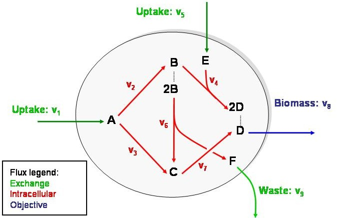

<h1>Table of Contents<span class="tocSkip"></span></h1>
<div class="toc"><ul class="toc-item"><li><span><a href="#ABC-model-of-metabolism" data-toc-modified-id="ABC-model-of-metabolism-1"><span class="toc-item-num">1&nbsp;&nbsp;</span>ABC model of metabolism</a></span><ul class="toc-item"><li><span><a href="#Implementation-of-the-ABC-model-using-Cobrapy" data-toc-modified-id="Implementation-of-the-ABC-model-using-Cobrapy-1.1"><span class="toc-item-num">1.1&nbsp;&nbsp;</span>Implementation of the ABC model using Cobrapy</a></span></li><li><span><a href="#Simulating-growth-rate-and-steady-state-fluxes-with-the-ABC-model" data-toc-modified-id="Simulating-growth-rate-and-steady-state-fluxes-with-the-ABC-model-1.2"><span class="toc-item-num">1.2&nbsp;&nbsp;</span>Simulating growth rate and steady-state fluxes with the ABC model</a></span><ul class="toc-item"><li><span><a href="#Cobrapy-implementation-of-the-optimization-problem" data-toc-modified-id="Cobrapy-implementation-of-the-optimization-problem-1.2.1"><span class="toc-item-num">1.2.1&nbsp;&nbsp;</span>Cobrapy implementation of the optimization problem</a></span></li><li><span><a href="#We-can-also-visualize-the-fluxes-on-the-network" data-toc-modified-id="We-can-also-visualize-the-fluxes-on-the-network-1.2.2"><span class="toc-item-num">1.2.2&nbsp;&nbsp;</span>We can also visualize the fluxes on the network</a></span></li></ul></li></ul></li><li><span><a href="#Cell-factory-design-questions-for-the-ABC-model" data-toc-modified-id="Cell-factory-design-questions-for-the-ABC-model-2"><span class="toc-item-num">2&nbsp;&nbsp;</span>Cell factory design questions for the ABC model</a></span><ul class="toc-item"><li><span><a href="#Optimizing-bioproduction." data-toc-modified-id="Optimizing-bioproduction.-2.1"><span class="toc-item-num">2.1&nbsp;&nbsp;</span>Optimizing bioproduction.</a></span></li><li><span><a href="#Shifting-metabolism-under-anaerobic-conditions" data-toc-modified-id="Shifting-metabolism-under-anaerobic-conditions-2.2"><span class="toc-item-num">2.2&nbsp;&nbsp;</span>Shifting metabolism under anaerobic conditions</a></span></li><li><span><a href="#Shifting-metabolism-under-nutrient-limitation" data-toc-modified-id="Shifting-metabolism-under-nutrient-limitation-2.3"><span class="toc-item-num">2.3&nbsp;&nbsp;</span>Shifting metabolism under nutrient limitation</a></span></li></ul></li></ul></div>

# ABC model of metabolism




The chemical equations for the ABC model are:

$$
\begin{array}{lrcl}
 R_1: & & \overset{v_1}{\rightarrow} & A \\
 R_2: & A & \overset{v_2}{\rightarrow} & B \\
 R_3: & A & \overset{v_3}{\rightarrow} & C \\
 R_4: & B + E & \overset{v_4}{\rightarrow}& 2D\\
 R_5:  & &\overset{v_5}{\rightarrow} & E \\
 R_6: & 2B & \overset{v_6}{\rightarrow} & C + F \\
 R_7: & C & \overset{v_7}{\rightarrow} & D \\
 R_8: & D & \overset{v_8}{\rightarrow} &  \\
 R_9: & F & \overset{v_9}{\rightarrow} &  \\
\end{array}
$$
 which can be represented as a Stoichiometric matrix $S$:
 
$$
S = \left[ {\begin{array}{cccccccccc}
  & R_1 & R_2 & R_3 & R_4 & R_5 & R_6 & R_7 & R_8 & R_9 \\
A & 1   & -1  & -1  & 0   & 0   & 0   & 0   & 0   & 0   \\
B & 0   &  1  & 0   & -1  & 0   & -2  & 0   & 0   & 0   \\
C & 0   &  0  & 1   & 0   & 0   & 1   & -1  & 0   & 0   \\
D & 0   &  0  & 0   & 2   & 0   & 0   &  1  & -1  & 0   \\
E & 0   &  0  & 0   & -1   & 1   & 0   &  0  & 0  & 0   \\
F & 0   &  0  & 0   &  0   & 0   & 1   &  0  & 0  & -1   \\
\end{array}}\right]
$$
## Implementation of the ABC model using Cobrapy


```python
import cobra
abc_model = cobra.Model('ABC_model')

A  = cobra.Metabolite('A',compartment='c')
B  = cobra.Metabolite('B',compartment='c')
C  = cobra.Metabolite('C',compartment='c')
D  = cobra.Metabolite('D',compartment='c')
E  = cobra.Metabolite('E',compartment='c')
F  = cobra.Metabolite('F',compartment='c')

abc_model.add_metabolites([A,B,C,D,E,F])

R_1 = cobra.Reaction('R_1')
R_2 = cobra.Reaction('R_2')
R_3 = cobra.Reaction('R_3')
R_4 = cobra.Reaction('R_4')
R_5 = cobra.Reaction('R_5')
R_6 = cobra.Reaction('R_6')
R_7 = cobra.Reaction('R_7')
R_8 = cobra.Reaction('R_8')
R_9 = cobra.Reaction('R_9')

abc_model.add_reactions([R_1, R_2, R_3, R_4, R_5, R_6, R_7, R_8, R_9])

R_1.build_reaction_from_string('--> A')
R_2.build_reaction_from_string('A --> B')
R_3.build_reaction_from_string('A --> C')
R_4.build_reaction_from_string('B + E --> 2 D')
R_5.build_reaction_from_string('--> E')
R_6.build_reaction_from_string('2 B --> C + F')
R_7.build_reaction_from_string('C --> D')
R_8.build_reaction_from_string('D -->')
R_9.build_reaction_from_string('F -->')

cobra.io.save_json_model(abc_model, 'ABC/abc_model.json')
cobra.util.array.create_stoichiometric_matrix(abc_model, 
                                              array_type='DataFrame').astype(int)
```

## Simulating growth rate and steady-state fluxes with the ABC model


Like the terraced pools of water in the geothermal hot springs of [Pamukkale, Turkey](https://rustytraveltrunk.com/pamukkale/), when the metabolic network is in steady state, the concentrations of the internal metabolites do not change. Therefore
$$ \frac{d\vec{c}}{dt} = S\cdot\vec{v} = 0$$
where $\frac{d\vec{c}}{dt}$ represents the change in metabolite concentrations with respect to time, and $\vec{v}$ are the  reaction rates (also known as fluxes), and $S$ is the stoichiometric matrix.


$$
\left[ {\begin{array}{c}
\frac{dA}{dt} \\ \frac{dB}{dt} \\ \frac{dC}{dt} \\ \frac{dD}{dt} \\ \frac{dE}{dt} \\ \frac{dF}{dt} \\
\end{array}}\right] = 
S\cdot\vec{v} = \left[ {\begin{array}{cccccccccc}
  & R_1 & R_2 & R_3 & R_4 & R_5 & R_6 & R_7 & R_8 & R_9 \\
A & 1   & -1  & -1  & 0   & 0   & 0   & 0   & 0   & 0   \\
B & 0   &  1  & 0   & -1  & 0   & -2  & 0   & 0   & 0   \\
C & 0   &  0  & 1   & 0   & 0   & 1   & -1  & 0   & 0   \\
D & 0   &  0  & 0   & 2   & 0   & 0   &  1  & -1  & 0   \\
E & 0   &  0  & 0   & -1   & 1   & 0   &  0  & 0  & 0   \\
F & 0   &  0  & 0   &  0   & 0   & 1   &  0  & 0  & -1   \\
\end{array}}\right]\cdot\left[ {\begin{array}{c}
v_1 \\ v_2 \\ v_3 \\ v_4 \\ v_5 \\ v_6 \\ v_7 \\ v_8 \\ v_9 \\
\end{array}}\right] = \left[ {\begin{array}{c}
v_1 - v_2 - v_3 \\ v_2 - v_4 - 2v_6 \\ v_3 + v_6 - v_7 \\ 2v_4 + v_7 - v_8 \\ -v_4 + v_5 \\ v_6 - v_9 \\
\end{array}}\right] = 0
$$


Suppose that the uptake rate of $A$ is limited to $10 \frac{mmol}{hour}$, and $D$ is biomass. What is the maximum growth rate achievable given the constraints of this network?  We can find the answer by solving the following optimization problem:
$$\begin{array}{ll}
    \underset{\vec{v}}{\mbox{maximize}}   & v_{8} \\
    \mbox{subject to}  & S\cdot \vec{v} = 0 \\
    & 0 \leq \vec{v}  \\
    & v_1 \leq 10 \\
\end{array}$$

### Cobrapy implementation of the optimization problem


```python
abc_model = cobra.io.load_json_model('ABC/ABC_model.json')
abc_model.objective = R_8
abc_model.reactions.R_1.upper_bound = 10
abc_model.optimize()
```

### We can also visualize the fluxes on the network


```python
import escher
reaction_scale = [ { 'type': 'min',  'color': '#c8c8c8', 'size': 12 },
                   { 'type': 'mean', 'color': '#9696ff', 'size': 20 },
                   { 'type': 'max',  'color': '#ff0000', 'size': 25 } ]
escher.Builder(map_json='ABC/abc_map.json',
               model=abc_model,
               reaction_data=abc_model.optimize().fluxes.to_dict(),
               reaction_scale=reaction_scale
              ).display_in_notebook()
```

# Cell factory design questions for the ABC model

1. What if we want to optimize bioproduction?
1. How does metabolism shift in response to anaerobic conditions?
1. How does metabolism shift in response to nutrient-limited conditions

## Optimizing bioproduction.

Since we are interested in microbial cell factories, let's think of $F$ as a high-value product.
What happens to the flux distribution and the growth rate if we maximize the production of $F$?

$$\begin{array}{ll}
    \underset{\vec{\bf v}}{\mbox{maximize}}   & v_9 \\
    \mbox{subject to}  & S\cdot v = 0 \\
    & 0 \leq v  \\
    & v_1 \leq 10 \\
\end{array}$$


```python
abc_model = cobra.io.load_json_model('ABC/abc_model.json')
abc_model.objective = R_9
abc_model.reactions.R_1.upper_bound = 10
R9_solution = abc_model.optimize()
display(R9_solution)
escher.Builder(map_json='ABC/abc_map.json',
               model=abc_model,
               reaction_data=R9_solution.fluxes.to_dict(),
               reaction_scale=reaction_scale
              ).display_in_notebook()
```

## Shifting metabolism under anaerobic conditions

In the ABC model, let's imagine that $E$ plays the role of oxygen in the metabolism of a facultative aerobe: having some makes the growth rate increase, but it is not strictly necessary for growth. What happens to the flux distribution if we try to grow without $E$ (an-$E$-robically?)  

$$\begin{array}{ll}
    \underset{\vec{\bf v}}{\mbox{maximize}}   & v_{8} \\
    \mbox{subject to}  & S\cdot v = 0 \\
    & 0 \leq v  \\
    & v_1 \leq 10 \\
    & v_5 \leq 0 \\
\end{array}$$


```python
abc_model = cobra.io.load_json_model('ABC/ABC_model.json')
abc_model.objective = R_8
abc_model.reactions.R_1.upper_bound = 10
abc_model.reactions.R_5.upper_bound = 0
no_R5_solution = abc_model.optimize()
display(no_R5_solution)

escher.Builder(map_json='ABC/abc_map.json',
               model=abc_model,
               reaction_data=no_R5_solution.fluxes.to_dict(), 
               reaction_scale=reaction_scale,
              ).display_in_notebook()
```

## Shifting metabolism under nutrient limitation

Now suppose that $E$ is a limiting nutrient (low oxygen instead of no oxygen).  How does the flux distribution shift to maximize growth?

$$\begin{array}{ll}
    \underset{\vec{\bf v}}{\mbox{maximize}}   & v_{8} \\
    \mbox{subject to}  & S\cdot v = 0 \\
    & 0 \leq v  \\
    & v_1 \leq 10 \\
    & v_5 \leq 5 \\
\end{array}$$


```python
abc_model = cobra.io.load_json_model('ABC/ABC_model.json')
abc_model.objective = R_8
abc_model.reactions.R_1.upper_bound = 10
abc_model.reactions.R_5.upper_bound = 5
display(abc_model.optimize())
escher.Builder(map_json='ABC/abc_map.json',
               model=abc_model,
               reaction_data=abc_model.optimize().fluxes.to_dict(), 
               reaction_scale=reaction_scale
              ).display_in_notebook()
```


The solutions described above are just a few possible steady-state flux distributions amongst many.  For the ABC model, all feasible steady-state flux distributions can be decomposed into non-negative combinations of just 3 elementary modes. Although elementary modes are useful conceptual framework for analyzing small networks, they are not practical for genome-scale network analysis because the number of elementary modes increases exponentially with the size of the network.  Nevertheless, for this toy problem elementary modes can be useful for interpreting solutions to the kinds of problems described above.

